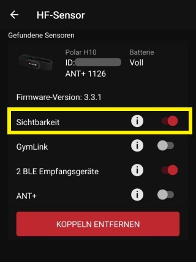
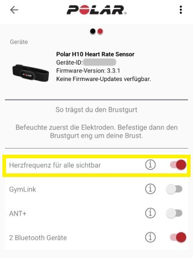

# Unreal Engine Project "Heartbeat" &ndash; Readme

* Author: Copyright 2025 Roland Bruggmann aka brugr9
* Profile on Epic Games Marketplace *FAB*: [https://www.fab.com/sellers/brugr9](https://www.fab.com/sellers/brugr9)
* Profile on Epic Developer Community: [https://dev.epicgames.com/community/profile/PQBq/brugr9](https://dev.epicgames.com/community/profile/PQBq/brugr9)

---


Unreal Engine Project "Heartbeat": Heart Rate Monitoring Integration

## Description

An Unreal&reg; Engine project as proof of concept for receiving physiological data from Polar&reg; H10 heart rate sensor via Blotooth and LabStreamingLayer.

* Index Terms: Physiological Measuring, Electrocardiogram, Heart Rate Monitoring, Integration, Messaging, Internet of Things, Machine to Machine
* Technology: Polar H10 HR Sensor with Chest Strap, Bluetooth Low Energy, LabStreamingLayer, Unreal Engine
* Tags: BLE, ECG, HR, HRM, IoT, LSL, PolarH10, UE

---

<div style='page-break-after: always'></div>

## Table of Contents

<!-- Start Document Outline -->

* [1. Concept](#1-concept)
* [2. Setup](#2-setup)
  * [2.1. Polar H10](#21-polar-h10)
  * [2.2. PolarBLE](#22-polarble)
  * [2.3. Unreal Engine](#23-unreal-engine)
* [3. UE Project Heartbeat](#3-ue-project-heartbeat)
  * [3.1. Startup](#31-startup)
* [Appendix](#appendix)
  * [Acronyms](#acronyms)
  * [Glossary](#glossary)
  * [A. References](#a-references)
  * [B. Readings](#b-readings)
  * [C. Acknowledgements](#c-acknowledgements)
  * [D. Attribution](#d-attribution)
  * [E. Disclaimer](#e-disclaimer)
  * [F. Citation](#f-citation)

<!-- End Document Outline -->

<div style='page-break-after: always'></div>

## 1. Concept

We setup a data flow as follows (see figure 1.1.):

<br>
*Figure 1.1.: Data Flow*

The Polar H10 sensor sends its data via Bluetooth Low Energy BLE (cp. [1]). Using the App *PolarBLE* we fetch the data and forward the same as LabStreamingLayer LSL streams (cp. [2] and [4]).

In the Unreal Engine we use the LabStreamingLayer Plugin (cp. [6]).

* The plugin comes with an Actor Component *LSLInlet*. With the Inlet a LSL stream can be accessed in the Blueprint System and the received data can be processed.
* The plugin comes also with an Actor Component *LSLOutlet*. The Outlet can be accessed in the Blueprint System and data can be streamed via LSL.

We record all the LSL streams using App *Lab Recorder* (cp. [5]).

<div style='page-break-after: always'></div>

## 2. Setup

### 2.1. Polar H10

1. Wear the Polar H10 HR Sensor with Chest Strap.
2. Assure that Polar H10 is visible via Bluethooth, resp. configure the H10 using Polar Beat App or Polar Flow App (see figures 2.1.1. and 2.1.2.).
3. On your laptop activate Bluetooth and pair Polar H10, e.g., via Bluetooth LE Explorer (cp. [2], see figures 2.1.3., 2.1.4. and 2.1.5.).

|  |  |
|:-------------------------:|:-------------------------:|
| *Figure 2.1.1.: App Polar Beat, Polar H10 Settings* | *Figure 2.1.2.: App Polar Flow, Polar H10 Settings* |

<br>
*Figure 2.1.3.: Bluetooth LE Explorer, Tab Discover listing Polar H10*

<br>
*Figure 2.1.4.: Bluetooth LE Explorer listing paired Polar H10*

<br>
*Figure 2.1.5.: Windows System Settings listing Polar H10 as connected*

<div style='page-break-after: always'></div>

### 2.2. PolarBLE

Install application *PolarBLE* (cp. [4]). Start the same and push the 'Scan'-Button (see figure 2.2.1.). Search for the listed Polar H10 and click on the same to start streaming (see figure 2.2.2.). We may use app *Lab Recorder* (cp. [5]) to check if the streams are up and running (see figure 2.2.3.).

|  |  |
|:-------------------------:|:-------------------------:|
| *Figure 2.2.1.: PolarBLE scanning and listing Polar H10* | *Figure 2.2.2.: PolarBLE streaming from Polar H10* |

<br>
*Figure 2.2.3.: Lab Recorder listing LSL Streams from Polar H10 ACC and ECG Data*

<div style='page-break-after: always'></div>

### 2.3. Unreal Engine

1. Using Epic Games Launcher install Unreal Engine version 5.3.
2. Purchase Unreal Engine LabStreamingLayer Plugin as found on the Epic Games Marketplace *FAB* (cp. [6]) and install the same to Unreal Engine version 5.3.
3. Clone UE project "Heartbeat53" using git, e.g., by ```git clone https://github.com/brugr9/Heartbeat53.git```.

<br>
*Figure 2.3.1.: Epic Games Launcher listing Project Heartbeat53 and LabStreamingLayer Plugin*

<div style='page-break-after: always'></div>

## 3. UE Project Heartbeat

### 3.1. Startup

Startup the UE project "Heartbeat53". In the Unreal Engine Editor the LabStreamingLayer plugin is found under "Edit > Plugins > Installed > Input Devices > LabStreamingLayer Plugin" (see figure 3.1.2.).

<br>
*Figure 3.1.1.: Splash Screen of UE Project "Heartbeat"*

<br>
*Figure 3.1.2.: Unreal Engine Plugins Browser Tab listing "LabStreamingLayer Plugin"*

<div style='page-break-after: always'></div>

### 3.2. Assets

### 3.3. LSL Actor Components

#### 3.3.1. LSL Inlet

ECG:

```csv
LSL timestamp; sensor timestamp [ns]; timestamp [ms]; ecg [uV]
2022-07-19T00:57:03.166;599616465930684049;0.0;10952
```

ACC:

```csv
LSL timestamp; sensor timestamp [ns]; X [mg]; Y [mg]; Z [mg]
2022-07-19T00:57:22.763;599616485954551349;-746;56;631
```

#### 3.3.2. LSL Outlet

While PIE, in app *Lab Recorder* push the Update-Button and check if the "UE_Heartbeat" stream gets listed (see figure 3.3.2.1.).

<br>
*Figure 3.3.2.1.: Lab Recorder listing LSL Streams from Polar H10 as well as from Unreal Engine*

<div style='page-break-after: always'></div>

## Appendix

### Acronyms

* ACC &mdash; Acceleration
* BLE &mdash; Bluetooth Low Energy
* ECG &mdash; Electrocardiogram
* HR &mdash; Heart Rate
* IoT &mdash; Internet of Things
* LSL &mdash; LabStreamingLayer
* PIE &mdash; Play-in-Editor
* PoC &mdash; Proof-of-Concept
* SCCN &mdash; Swartz Center for Computational Neuroscience
* UCSD &mdash; University of California, San Diego
* UE &mdash; Unreal Engine

<div style='page-break-after: always'></div>

### Glossary

#### System Integration and Coupling

> System integration and coupling are central concepts in modern software development, enabling the support of complex and diverse workflows through tailored solutions:
>
> * System integration refers to the unification of functionalities within a single software, data into a shared structure, or processes through a common platform.
> * System coupling, on the other hand, describes the collaboration of specialized tools via well-coordinated interfaces.

mip Consult GmbH, [https://mip-software.com/system-integration-and-coupling/](https://mip-software.com/system-integration-and-coupling/)

#### What is the Bluetooth transmission range of Polar H9/H10 HR sensor?

> The transmission range with H9/H10 is 5 meters (16.4 ft) at the minimum in optimal conditions. Typically the range varies between 10 to 35 meters (32.8 to 114.8 ft), and in extremely rare top outdoors conditions, on an open field, the range can reach even up to 100 meters (328.1 ft). There are several variables that affect the range and therefore an exact range cannot be stated. The best range is achieved with line-of-sight positioning between the sensor and receiver. Indoors, obstacles such as concrete walls will attenuate the radio signal when passing through and the effective range will be drastically reduced, but on the other hand the radio signal can bounce from walls and thereby improve the range inside the room in cases where there is no direct line-of-sight situation between the sensor and receiver (for example, in a sports hall or gym).
>
>Some other variables affecting the range are signals from other wireless devices (such as Wi-Fi stations or a large number of other Bluetooth devices nearby; even a microwave oven can interfere with the Bluetooth signal) and the quality of the receiver. Polar receivers are confirmed to meet the requirements. High air humidity can also affect the range in some cases. Furthermore, a human body creates considerably high attenuation for the Bluetooth radio signal and therefore, if you hold your receiver behind your back near your skin, the connection might be lost (for example, while speed skating)

Polar Electro Support, [https://support.polar.com/en/support/what_is_the_bluetooth_transmission_range_of_polar_h10_hr_sensor](https://support.polar.com/en/support/what_is_the_bluetooth_transmission_range_of_polar_h10_hr_sensor)

<div style='page-break-after: always'></div>

### A. References

* [1] Polar Electro: *Polar H10*. Heart Rate Sensor with Chest Strap, Online: [https://www.polar.com/en/sensors/h10-heart-rate-sensor](https://www.polar.com/en/sensors/h10-heart-rate-sensor)
* [2] Microsoft Store: *Bluetooth LE Explorer*. Online: [https://apps.microsoft.com/detail/9n0ztkf1qd98](https://apps.microsoft.com/detail/9n0ztkf1qd98)
* [3] LabStreamingLayer Website. Online: [https://labstreaminglayer.org/](https://labstreaminglayer.org/)
* [4] Mark M. Span: App *PolarBLE*, GitHub Repository, Online: [https://github.com/markspan/PolarBLE](https://github.com/markspan/PolarBLE)
* [5] LabStreamingLayer App *Lab Recorder*, GitHub Repository, Online: [https://github.com/labstreaminglayer/App-LabRecorder](https://github.com/labstreaminglayer/App-LabRecorder)
* [6] Bertrand Richard: Unreal Engine *LabStreamingLayer Plugin*, on Epic Games Marketplace *FAB*: [https://www.fab.com/listings/67c60b96-90d1-4261-92a4-19a098a76c63](https://www.fab.com/listings/67c60b96-90d1-4261-92a4-19a098a76c63); GitHub Repository: [https://github.com/labstreaminglayer/plugin-UE4](https://github.com/labstreaminglayer/plugin-UE4)

### B. Readings

* Ch&#281;&cacute;, A.; Olczak, D.; Fernandes, T. and Ferreira, H. (2015): *Physiological Computing Gaming - Use of Electrocardiogram as an Input for Video Gaming*. In: Proceedings of the 2nd International Conference on Physiological Computing Systems - PhyCS, ISBN 978-989-758-085-7; ISSN 2184-321X, pages 157-163. DOI: [10.5220/0005244401570163](http://dx.doi.org/10.5220/0005244401570163)
* Kothe, Christian et al. (2024): *The Lab Streaming Layer for Synchronized Multimodal Recording*. In: bioRxiv &ndash; The Preprint Server for Biology. Cold Spring Harbor Laboratory. DOI: [10.1101/2024.02.13.580071](https://doi.org/10.1101/2024.02.13.580071)

<div style='page-break-after: always'></div>

### C. Acknowledgements

* Logo: "*A red heart with a heartbeat to the right*", by Diego Naive / Joe Sutherland, June 6, 2018. Online: [https://de.wikipedia.org/wiki/Datei:Red_heart_with_heartbeat_logo.svg](https://de.wikipedia.org/wiki/Datei:Red_heart_with_heartbeat_logo.svg), licensed [CC BY 4.0](http://creativecommons.org/licenses/by/4.0/).
* Typeface: Harlow Solid Italic, Designed by Colin Brignall.
* 3D Model: "*Heart*", by phenopeia, January 16, 2015. Online: [https://skfb.ly/CCyL](https://skfb.ly/CCyL), licensed [CC BY 4.0](http://creativecommons.org/licenses/by/4.0/).

### D. Attribution

* The word mark Unreal and its logo are Epic Games, Inc. trademarks or registered trademarks in the US and elsewhere.
* The word mark Polar and its logos are trademarks of Polar Electro Oy.
* The Bluetooth word mark and logos are registered trademarks owned by Bluetooth SIG, Inc.
* Windows is a registered trademark of Microsoft Corporation.
* From the Website of LabStreamingLayer:
  * "The Lab Streaming Layer was originally created by Christian Kothe while at the Swartz Center for Computational Neuroscience at the University of California, San Diego. The project is currently maintained by an international team of developers (see contributors), with contributions from LSL community users and hardware/software vendors."
  * "The LSL project has been funded in part by the Army Research Laboratory (under Cooperative Agreement Number W911NF-10-2-0022) and the National Institute of Neurological Disorders and Stroke (grant 3R01NS047293-06S1)."

### E. Disclaimer

This documentation has **not been reviewed or approved** by the *Food and Drug Administration FDA* or by any other agency. It is the users responsibility to ensure compliance with applicable rules and regulations&mdash;be it in the US or elsewhere.

### F. Citation

To acknowledge this work, please cite

> Bruggmann, R. (2025): Unreal&reg; Engine Project "Heartbeat" [Computer software], Version v5.3.1. Licensed under Creative Commons Attribution-ShareAlike 4.0 International. Online: https://github.com/brugr9/Heartbeat53

---
<!-- Footer -->

[](https://creativecommons.org/licenses/by-sa/4.0/)

*Unreal&reg; Engine Project "Heartbeat"* &copy; 2025 by [Roland Bruggmann](https://dev.epicgames.com/community/profile/PQBq/brugr9) is licensed under [Creative Commons Attribution-ShareAlike 4.0 International](http://creativecommons.org/licenses/by-sa/4.0/)
