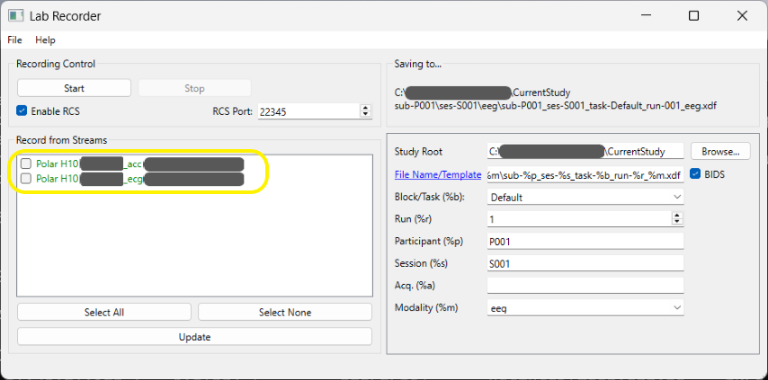

# Unreal Engine Project "Heartbeat" &ndash; Readme

* Author: Copyright 2025 Roland Bruggmann aka brugr9
* Profile on Epic Games Marketplace *FAB*: [https://www.fab.com/sellers/brugr9](https://www.fab.com/sellers/brugr9)
* Profile on Epic Developer Community: [https://dev.epicgames.com/community/profile/PQBq/brugr9](https://dev.epicgames.com/community/profile/PQBq/brugr9)

---


Unreal Engine Project "Heartbeat" &mdash; Heart Rate Monitoring Integration

## Description

An Unreal&reg; Engine project as proof of concept for receiving physiological data from Polar&reg; H10 heart rate monitor.

* Index Terms: Physiological Measuring, Electrocardiogram, Heart Rate Monitoring, Integration, Messaging, Internet of Things, Machine to Machine
* Technology: Polar H10 HR Sensor with Chest Strap, Bluetooth Low Energy, LabStreamingLayer, Unreal Engine
* Tags: BLE, ECG, HR, HRM, IoT, LSL, M2M, PolarH10, UE

---

<div style='page-break-after: always'></div>

## Table of Contents

<!-- Start Document Outline -->

* [1. Concept](#1-concept)
* [2. Setup](#2-setup)
  * [2.1. Polar H10](#21-polar-h10)
  * [2.2. PolarBLE](#22-polarble)
  * [2.3. Unreal Engine](#23-unreal-engine)
* [3. UE Project Heartbeat](#3-ue-project-heartbeat)
  * [3.1. Startup](#31-startup)
* [Appendix](#appendix)
  * [Acronyms](#acronyms)
  * [Glossary](#glossary)
    * [HRM – Heart Rate Variability](#hrm--heart-rate-variability)
    * [HRM – RR Interval](#hrm--rr-interval)
  * [A. References](#a-references)
  * [B. Readings](#b-readings)
  * [C. Acknowledgements](#c-acknowledgements)
  * [D. Attribution](#d-attribution)
  * [E. Disclaimer](#e-disclaimer)
  * [F. Citation](#f-citation)

<!-- End Document Outline -->

<div style='page-break-after: always'></div>

## 1. Concept

We setup a data flow as follwos (see figure 1.1.):

<br>
*Figure 1.1.: Data Flow*

The Polar H10 sensor sends its data via Bluetooth Low Energy BLE (cp. [1]). Using the App *PolarBLE* we fetch the data and forward the same as LabStreamingLayer LSL streams (cp. [2] and [4]).

In the Unreal Engine we use the LabStreamingLayer Plugin (cp. [6]).

* The plugin comes with an Actor Component *LSLInlet*. With the Inlet a LSL stream can be accessed in the Blueprint System and the received data can be processed.
* The plugin comes also with an Actor Component *LSLOutlet*. The Outlet can be accessed in the Blueprint System and data can be streamed via LSL.

We record all the LSL streams with App *Lab Recorder* (cp. [5]).

## 2. Setup

### 2.1. Polar H10

1. Wear the Polar H10 HR Sensor with Chest Strap.
2. Assure that Polar H10 is visible via Bluethooth, resp. configure the H10 using Polar Flow App or Polar Beat App.
3. On your laptop activate Bluetooth and pair Polar H10, e.g., via Bluetooth LE Explorer (cp. [2]).

<br>
*Figure 2.1.1.: Bluetooth LE Explorer, Tab Discover listing Polar H10*

<br>
*Figure 2.1.2.: Bluetooth LE Explorer listing paired Polar H10*

<br>
*Figure 2.1.3.: Windows System Settings listing Polar H10 as connected*

### 2.2. PolarBLE

Install application *PolarBLE* (cp. [4]). Start the same, click the 'Scan'-Button and search for the listed Polar H10 (see Figure 2.2.1.). Click on the listed Polar H10 device to start the LSL streams (ECG and ACC). We may use app *Lab Recorder* (cp. [5]) to check if the streams are up and running (see Figure 2.2.2.).

<br>
*Figure 2.2.1.: PolarBLE listing Polar H10*

<br>
*Figure 2.2.2.: Lab Recorder listing LSL Streams from Polar H10 AAC and ECG Data*

<div style='page-break-after: always'></div>

### 2.3. Unreal Engine

1. Using Epic Games Launcher install Unreal Engine version 5.3.
2. Purchase Unreal Engine LabStreamingLayer Plugin as found on the Epic Games Marketplace *FAB* (cp. [6]) and install the same to Unreal Engine version 5.3.
3. Clone UE project "Heartbeat53" using git, e.g., by ```git clone https://github.com/brugr9/Heartbeat53.git```.

<br>
*Figure 2.3.1.: UE Project Heartbeat53 in Epic Games Launcher*

## 3. UE Project Heartbeat

## 3.1. Startup

Startup the UE project "Heartbeat53" (see Figure 3.1.). In the Unreal Engine Editor the LabStreamingLayer plugin is found under "Edit > Plugins > Installed > Input Devices > LabStreamingLayer Plugin" (see Figure 3.2.).

<br>
*Figure 3.1.: Splash Screen of UE Project "Heartbeat"*

<br>
*Figure 3.2.: Unreal Engine Plugins Browser Tab listing "LabStreamingLayer Plugin"*

<!-->
ECG:

LSL timestamp; sensor timestamp [ns]; timestamp [ms]; ecg [uV]
2022-07-19T00:57:03.166;599616465930684049;0.0;10952

ACC:

LSL timestamp; sensor timestamp [ns]; X [mg]; Y [mg]; Z [mg]
2022-07-19T00:57:22.763;599616485954551349;-746;56;631
<-->

<br>
*Figure 3.: Lab Recorder listing LSL Streams from Polar H10 as well as from Unreal Engine*

<div style='page-break-after: always'></div>

## Appendix

### Acronyms

* ACC &mdash; Acceleration
* BLE &mdash; Bluetooth Low Energy
* bpm &mdash; Beats per Minute
* ECG &mdash; Electrocardiogram
* HR &mdash; Heart Rate
* HRM &mdash; Heart Rate Monitor
* HRV &mdash; Heart Rate Variability
* IBI &mdash; Interbeat Interval
* IoT &mdash; Internet of Things
* LSL &mdash; LabStreamingLayer
* M2M &mdash; Machine to Machine
* PIE &mdash; Play-in-Editor
* PoC &mdash; Proof-of-Concept
* RRI &mdash; RR Interval
* SCCN &mdash; Swartz Center for Computational Neuroscience
* UCSD &mdash; University of California, San Diego
* UE &mdash; Unreal Engine

<div style='page-break-after: always'></div>

### Glossary

#### HRM &ndash; RR Interval

The RR interval RRI is an interbeat interval IBI, more precisely the time elapsed between two successive R-waves of the QRS signal on the electrocardiogram, in milliseconds [ms] (cp. [10] and [11]).

#### HRM &ndash; Heart Rate Variability

In a healthy person, the heart does not beat with a fixed frequency, i.e. with a resting pulse of, for example, 60 heartbeats per minute, each beat does not occur after exactly one second or 1000 milliseconds. Fluctuations of 30 to 100 milliseconds in the heartbeat sequence occur as a natural mode of operation of the heart.

> *Heart rate variability (HRV) is the amount by which the time interval between successive heartbeats (interbeat interval, IBI) varies from beat to beat. The magnitude of this variability is small (measured in milliseconds), and therefore, assessment of HRV requires specialized measurement devices and accurate analysis tools. Typically HRV is extracted from an electrocardiogram (ECG) measurement by measuring the time intervals between successive heartbeats [...].*
*Heart rate variability in healthy individuals is strongest during rest, whereas during stress and physical activity HRV is decreased. The magnitude of heart rate variability is different between individuals. High HRV is commonly linked to young age, good physical fitness, and good overall health.*
(Kubios, cp. [12]).

<div style='page-break-after: always'></div>

### A. References

* [1] Polar Electro: *Polar H10*. Heart Rate Sensor with Chest Strap, Online: [https://www.polar.com/en/sensors/h10-heart-rate-sensor](https://www.polar.com/en/sensors/h10-heart-rate-sensor)
* [2] Microsoft Store: *Bluetooth LE Explorer*. Online: [https://apps.microsoft.com/detail/9n0ztkf1qd98](https://apps.microsoft.com/detail/9n0ztkf1qd98)
* [3] LabStreamingLayer Website. Online: [https://labstreaminglayer.org/](https://labstreaminglayer.org/)
* [4] Mark M. Span: App *PolarBLE*, GitHub Repository, Online: [https://github.com/markspan/PolarBLE](https://github.com/markspan/PolarBLE)
* [5] LSL App *Lab Recorder*, GitHub Repository, Online: [https://github.com/labstreaminglayer/App-LabRecorder](https://github.com/labstreaminglayer/App-LabRecorder)
* [6] Bertrand Richard: Unreal Engine *LabStreamingLayer Plugin*, on Epic Games Marketplace *FAB*: [https://www.fab.com/listings/67c60b96-90d1-4261-92a4-19a098a76c63](https://www.fab.com/listings/67c60b96-90d1-4261-92a4-19a098a76c63); GitHub Repository: [https://github.com/labstreaminglayer/plugin-UE4](https://github.com/labstreaminglayer/plugin-UE4)
* [10]  *RR Interval*. In: ScienceDirect. From: Principles and Practice of Sleep Medicine (Fifth Edition), 2011. Online: [https://www.sciencedirect.com/topics/nursing-and-health-professions/RR-interval](https://www.sciencedirect.com/topics/nursing-and-health-professions/RR-interval)
* [11] Mike Cadogan: *R wave Overview*. February 4, 2021. In: Live In The Fastlane &ndash; ECG Library, ECG Basics. Online: [https://litfl.com/r-wave-ecg-library/](https://litfl.com/r-wave-ecg-library/)
* [12] *About Heart Rate Variability (HRV)*. In: Website of Kubios Oy, Section "HRV Blog". Online: [https://www.kubios.com/blog/about-heart-rate-variability/](https://www.kubios.com/blog/about-heart-rate-variability/)

### B. Readings

* Ch&#281;&cacute;, A.; Olczak, D.; Fernandes, T. and Ferreira, H. (2015): *Physiological Computing Gaming - Use of Electrocardiogram as an Input for Video Gaming*. In: Proceedings of the 2nd International Conference on Physiological Computing Systems - PhyCS, ISBN 978-989-758-085-7; ISSN 2184-321X, pages 157-163. DOI: [10.5220/0005244401570163](http://dx.doi.org/10.5220/0005244401570163)
* Kothe, Christian et al. (2024): *The LabStreamingLayer for Synchronized Multimodal Recording*. In: bioRxiv &ndash; The Preprint Server for Biology. Cold Spring Harbor Laboratory. DOI: [10.1101/2024.02.13.580071](https://doi.org/10.1101/2024.02.13.580071)

### C. Acknowledgements

* Logo: "*A red heart with a heartbeat to the right*", by Diego Naive / Joe Sutherland, June 6, 2018. Online: [https://de.wikipedia.org/wiki/Datei:Red_heart_with_heartbeat_logo.svg](https://de.wikipedia.org/wiki/Datei:Red_heart_with_heartbeat_logo.svg), licensed [CC BY 4.0](http://creativecommons.org/licenses/by/4.0/).
* Typeface: Harlow Solid Italic, Designed by Colin Brignall.
* 3D Model: "*Heart*", by phenopeia, January 16, 2015. Online: [https://skfb.ly/CCyL](https://skfb.ly/CCyL), licensed [CC BY 4.0](http://creativecommons.org/licenses/by/4.0/).

<div style='page-break-after: always'></div>

### D. Attribution

* The word mark Unreal and its logo are Epic Games, Inc. trademarks or registered trademarks in the US and elsewhere.
* The word mark Polar and its logos are trademarks of Polar Electro Oy.
* The Bluetooth word mark and logos are registered trademarks owned by Bluetooth SIG, Inc.
* Windows is a registered trademark of Microsoft Corporation.
* From the Website of LabStreamingLayer:
  * "The Lab Streaming Layer was originally created by Christian Kothe while at the Swartz Center for Computational Neuroscience at the University of California, San Diego. The project is currently maintained by an international team of developers (see contributors), with contributions from LSL community users and hardware/software vendors."
  * "The LSL project has been funded in part by the Army Research Laboratory (under Cooperative Agreement Number W911NF-10-2-0022) and the National Institute of Neurological Disorders and Stroke (grant 3R01NS047293-06S1)."

### E. Disclaimer

This documentation has **not been reviewed or approved** by the *Food and Drug Administration FDA* or by any other agency. It is the users responsibility to ensure compliance with applicable rules and regulations&mdash;be it in the US or elsewhere.

### F. Citation

To acknowledge this work, please cite

> Bruggmann, R. (2025): Unreal&reg; Engine Project "Heartbeat" [Computer software], Version v5.3.1. Licensed under Creative Commons Attribution-ShareAlike 4.0 International. Online: https://github.com/brugr9/Heartbeat53

```bibtex
@software{Bruggmann_Heartbeat_2025,
  author = {Bruggmann, Roland},
  year = {2025},
  version = {v5.3.1},
  title = {{Unreal Engine Project 'Heartbeat'}},
  url = {https://github.com/brugr9/Heartbeat53}
}
```

---
<!-- Footer -->

[](https://creativecommons.org/licenses/by-sa/4.0/)

*Unreal&reg; Engine Project "Heartbeat"* &copy; 2025 by [Roland Bruggmann](https://dev.epicgames.com/community/profile/PQBq/brugr9) is licensed under [Creative Commons Attribution-ShareAlike 4.0 International](http://creativecommons.org/licenses/by-sa/4.0/)
